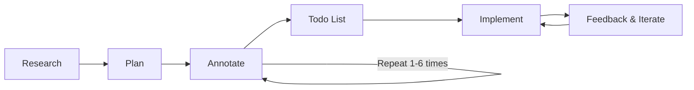

# Transactional Sandbox

A place to test different approaches for transactional prediction purpose.

# Vibe Coding

This repository uses the [Boris Tane](https://boristane.com/blog/how-i-use-claude-code/) framework to conduct the analysis. The approach involves using AI agents that generate code under the supervision of a human (you), with all rules defined in configuration files.

The framework can be represented as follow:

*Note: The `Feedback & Iterate` points back to the `Implement` because you have to have observe if the tasks are correctly done*

